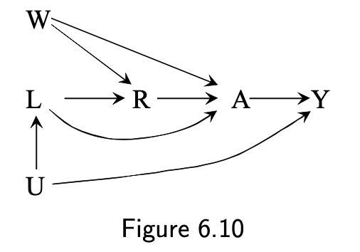
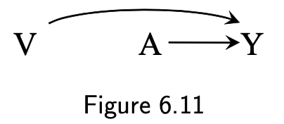
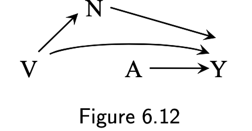
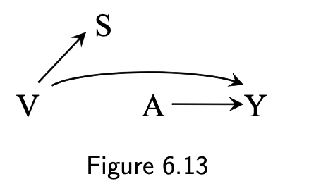
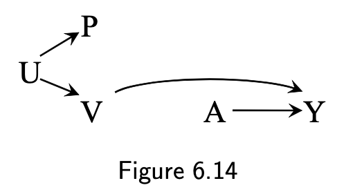
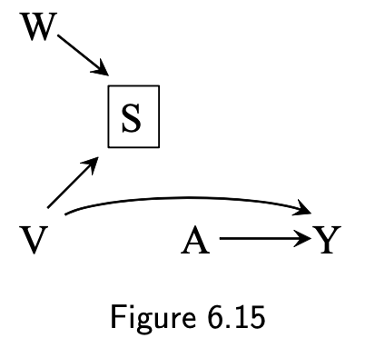

# Graphical representation of causal effects

## 6.0 Introduction

* Causal inferenceには，因果パスについての専門知識と検証不可能な仮定が必要
  * これまでは，シンプルな設定におけるCausal effectを計算するための条件や方法に焦点をあててきた
* 興味のある因果構造についての専門知識や仮定を質的に表現するGraphical toolを導入する
* 知識や仮定を直感的にまとめることにより，Graphは研究者間のコミュニケーションを強化する

## 6.1 Causal representation of causal effects

* Graph \(causal diagram\)は因果的な概念を表す

* Graphはnodeとedgesで構成される（Figure 6.1）
  * nodeは確率変数（L, A, Y）
  * edgeは矢印
  * 時間は左から右に流れる
    * LはAとYより時間的に先行
    * AはYより時間的に先行
  * Lは疾病の重症度，Aは心移植，Yは死亡を表す
* VからWへ矢印があることは，少なくとも一人において，direct causal effectがあることを示す
  * 他の変数で媒介（mediate）されていない
* VからWへ矢印がないことは，集団内で誰一人，direct causal effectがないことを示す
* causal diagramでは，矢印が不利益（害）であるか，利益（保護）であるかは区別できない
* Yの2つの原因であるAとLがどのように相互するかは表現していない
* Causal diagramsは，Directed acyclic graph: DAG
* Directed: 矢印は，影響の方向を意味する
* Acyclic: 巡回しない．変数は，直接または他の変数を介して，自身の原因にはならない
* DAG上のどの変数も，直接原因を条件づけた上で，原因でない他のどの変数からも独立している（Technical Point 6.1）
* Figure 6.1はConditionally randomized experiment
  * common causeはGraphに含める必要がある
* Figure 6.2はmarginal randomized experiment

* Figure 6.1はobservational studyを表しているかもしれない
  * Aは原因としてLを持つ．Yの原因もL以外にない
  * もしあるならば，例え測定されていなかったとしても共通原因であるため図に含めるべき
* 6.2では，conditional exchangeabilityの仮定をどのように図式化するか説明する
* 多くの人にとって，graphical approachの方がcounterfactual approachより使いやすく直感的である
  * しかし，これらは密接にリンクしている（Technical Point 6.2）
  * conventional causal diagramはcounterfactual variableをグラフ上で含んでいない
  * Single World Intervention Graph \(SWING\)は，どちらも扱える
    * Chapter 7で説明
* Causal diagramは，問題の質的な因果構造についての専門知識や仮定をシンプルに表す方法
  * Causal diagramは，因果ネットワーク内の変数間の潜在的な関連も表す

## 6.2 Causal diagrams and marginal independence

* A: aspirin use -&gt; 心臓病Yのリスクを予防するcausal effectを持つ

$$
\Pr(Y^{a=1}=1) \neq \Pr(Y^{a=0}=1)
$$

* Figure 6.2は，Aをランダムに，条件づけずに割り付けた状況をグラフに表している
* ライターの所持Aは，誰の肺がんYリスクのcausal effect（引き起こす or 予防）はない

$$
\Pr(Y^{a=1}=1) = \Pr(Y^{a=0}=1)
$$

* 喫煙Lは，AとY両方に対しcausal effectを持つ

* Figure 6.2と6.3は，因果関係についての知識のみを用いて書かれたが，予測される変数間の関連性も表している

  * どちらの図でもAとYは関連する

* **Figure 6.2（randomized experiment）について考える**
  * AがYへのcausal effectを持つとき，AとYは関連あることが期待できる
  * unconditional exchangeabilityであるideal randomized experimentでは，causationはassociationを示す．逆も然りである．

$$
\Pr(Y^{a=1}=1) \neq \Pr(Y^{a=0}=1) \to \Pr(Y = 1| A=1) \neq \Pr(Y = 1| A=0) \\
\Pr(Y = 1| A=1) \neq \Pr(Y = 1| A=0) \to \Pr(Y^{a=1}=1) \neq \Pr(Y^{a=0}=1)
$$

* CausationでなくAssociationは，2つの変数の間の関係が対称である．因果関係の矢印の方向に関係なく，2つの変数の間には関連の流れがある．

  * Figure 6.2は，AからYへの関連の流れ，もしくはYからAへの関連の流れがある

* **Figure 6.3 \(Observational study\)について考える**
  * ライターの所持Aは，肺がんYのcausal effectは持たない
  * 今の疑問は，ライターAが肺がんYと関連するかどうか

$$
\Pr(Y^{a=1}=1) = \Pr(Y^{a=0}=1) \to \Pr(Y = 1| A=1) = \Pr(Y = 1| A=0) \>??
$$

* 世間知らずの研究者が，肺がんYのリスクへのライター所持Aのeffectがあるか研究することにしたと想像する
  * 彼は，多くの人に，ライターを所持しているかどうか記録し，向こう5年の間に彼らが肺がんと診断されたかどうか記録した
  * Heraは，ライターを所持している
  * もし，Heraがライターを所持しているならば，彼女はsmokerである可能性が高い，故に，肺がんになるリスクは高い
  * 直感的に，AとYには関連が期待される
    * A=1の集団での肺がんリスクとA=0の集団での肺がんリスクは異なるだろう

$$
\Pr(Y=1|A=1) \neq \Pr(Y=1 | A = 0)
$$

* **treatment Aはoutcome Yを予測する能力を向上させる**
  * たとえ，AはYへのcausal effectを持たなくても！
* 研究者は，AとYは関連するから，AはYへのcausal effectを持つと間違いをする．
  * Causal graph理論は，直感を確認する
* AとYは関連する

  * なぜなら，共通原因Lを通して，AからY（or YからA）への関連の流れがあるから

* **3つ目の例**
  * Aはハプロタイプ（遺伝子のタイプのようなもの）
  * ハプロタイプAは，誰一人として喫煙Yのcausal effectを持たない

$$
\Pr(Y^{a=1}=1) = \Pr(Y^{a=0}=1)
$$

* ハプロタイプAも喫煙Yも心臓病Lのcausal effectを持つ
* Lは，AとYの共通効果（common effect）である

  * common effectであるLを，colliderという（A -&gt; L &lt;- Y）

* AとYは関連するか？
  * ハプロタイプAが喫煙Yになるリスクの効果を持つか研究することになるか想像する
  * 彼女は，多くの子供達の遺伝子を決定し，その子どもたちが喫煙者になるかどうかを記録している
  * ApolloはハプロタイプAを持たない（A=0）
  * 彼は喫煙する（Y=1）可能性が高いか低いか？
  * ハプロタイプAを持とうが持たないがYのリスクは同じなので，ハプロタイプAはYを予測する能力を向上させない

$$
\Pr(Y=1|A=1) = \Pr(Y=1 | A = 0)
$$

$$
A \!\perp\!\!\!\perp Y
$$

* Causal graphs theoryでは，collidersはそれらが間にある変数間の関連のパスをブロックする
* AとYは独立である
  * なぜなら，A -&gt; L &lt;- Yはcollider Lでブロックされているから
* 2つの変数が関連するとは，一つが他の原因となる，もしくはそれらが共通原因を持つ
  * それ以外であれば，それらは \(marginally\) independent

## 6.3 Causal diagrams and conditional independence

### **Figure 6.2とFigure 6.5**

* aspirin\(A\)とheart disease\(Y\)は関連する
  * なぜなら，aspirinはheart diseaseへのcausal effectを持つから
* 情報を追加
  * aspirinはheart diseaseに影響する
    * なぜなら，aspirinは，血小板の凝固（B）を減らすから（Figure 6.5）
    * ここでBは，AのYへの効果のmediatorである
* これにより新しい疑問を導入できる
  * Bのレベル内（conditional on）で，AとYは関連するか？
  * Bの情報があるときに，AはYの予測能力を向上させるか？
* Bを四角で囲むことは，Bでrestriction（制限）かけることを意味する
* 血小板の凝固が低い人（B=0）は，心臓病の平均的なリスクも低い
  * B=0と制限かけたことで，A=1であろうとA=0であろうと心臓病のリスクは低い
* aspirinがBを通してのみ心臓病に影響するので，個人の治療情報は心臓病を予測することに貢献しない
* Bのsubset内で，AとYは関連しない
  * 例え，AとYがmarginally associatedでも，AとYはBを与えた下で条件つき独立（unassociated）である．
* 変数Bを囲むことは，A -&gt; B \_&gt; Yの関連の流れをブロックする

$$
\Pr(Y = 1| A = 1, B = b) = \Pr(Y = 1|A=0, B=b) \> for \> all \> b
$$

$$
A \!\perp\!\!\!\perp Y | B
$$

### **Figure 6.3とFigure 6.6**

* Lを条件づけた上で，AはYと関連するか？（Figure 6.6）
* nonsmokers\(L = 1\)に限定する
* 個人がライターを所持することを知っても肺がんのリスクの予測には役立たない
  * より良い予測のための議論全体が，ライターを持っている人は喫煙者である可能性が高いという自室に依存しているから
* 例え，AとYがmarginally associatedであっても，Lを条件づけた下で，AとYはconditionally independentである
* Lを条件づけることでA &lt;- L -&gt; Yはブロックされるので，AとYの関連の流れは途切れる

$$
\Pr(Y = 1| A = 1, L = l) = \Pr(Y = 1|A=0, L=l) \> for \> all \> l
$$

$$
A \!\perp\!\!\!\perp Y | L
$$

### Figure 6.4とFigure 6.7

* Figure 6.4では，AとYは，collider Lでブロックされるので，独立である
* 共通効果Lのレベル内で，AとYはconditionally associatedになるだろう
* Sudy populationを心臓病（L = 1）を持つ個人に限定し，ハプロタイプAの喫煙Yの効果を評価する
  * この時，ハプロタイプを持たない（A=0）であることは，喫煙者であるという情報をもたらすだろう
    * Aが欠如している状態において，Lの原因であるYが存在している可能性が高くなる
  * 心臓病の集団において，ハプロタイプを持たない人の方が喫煙者の割合が高くなる
* Lで条件づけると，AとYは逆の関連がある
* Lのレベル内でAとYに関連があるからAはYのcausal effectを持つと間違って結論づけると，研究者は間違いを犯す
* 極端な話し，もしAとYだけがLの原因だとしたら、心臓病の人の間では、どちらか一方の原因がなければ、もう一方の原因があることを完全に予測することができる
* Causal graphs theoryでは，Lのようなcolliderで条件付をすると，条件付をしていないときにはblockされていたA -&gt; L &lt;- Yの経路が開かれる
* 直感的には、2つの変数（原因）が関連しているかどうかは、将来のイベント（それらの効果）によって影響を受けることはできないが，与えられた効果の2つの原因は，一般的に，共通の効果で層別化すると関連する

### Figure 6.8

* Figure 6.7に利尿治療Cを追加
  * これは心臓病の診断の結果使われる
* AとYは，Cのレベル内でも関連する
  * CはAとYの共通効果であるから
* Causal graphs theory ではcollider Lの影響をうけるCを条件づけることは，A -&gt; L &lt;- Yのパスを開く
* これをブロックするには，LかCの両方を条件付けない

* 構造的な理由と違い，chance or random variabilityが関連の原因になることもある
  * これはサンプルサイズを増やすことにより，その可能性を低くできる
  * Chapter 10までは，十分大きな集団として扱う

## 6.4 Positivity and consistency in causal diagrams

* 表現（counterfactuals or graphs）に関わらず，standardization or IP weightingを用いた因果推論には，exchangeability, positivity, consistencyが必要
  * これらの条件を保持できないと，解析から得られる数値は適切に解釈できないかもしれない
  * Chapters 7 and 8でexchangeability conditionをどのようにgraphに書き起こすのか議論する
  * ここでは，positivityとconsistencyに焦点を当てる

### Positivity

* LからAへの矢印が決定論的ではないか
* この本では，特に断りが無い限り，positivityは満たされている
* treatment nodeに入る矢印に関連する

### First component of consistency \(well-defined interventions\)

* 治療Aから結果Yへの矢印が比較的あいまいでない介入に対応するか
* この本では，well-defined interventionである
* treatment nodeから放たれる矢印に関連する

### Different status of treatment node

* Treatment nodeは他のnodeと特徴が違う
* 一つのあわらし方は，Chapter 2で示したcausal trees
  * これはChapter 5で学習したsufficient causesを表し，background factors Uを含む
* このChapterでは，全ての変数に同じ状態を割り付けているようにみえる
  * これはnonparametric structural equations model \(Technical Point 6.2\)
  * これは，いくつかの変数がill-definedのとき，ミスリードかもしれない
* Causal diagramsでは，複数のversionを持つtreatment nodeは，十分にwell-definedでなければならない

### For example

* Compound treatment Rのcausal effectに興味ある
  * R = 1は，毎日少なくとも30分の運動をすること
  * R = 0は，毎日30分未満の運動をすること
  * 30分以上運動する個人はR = 1と分類され，可能な持続時間30, 31, 32...分のそれぞれはR = 1の異なるversionと見ることができる
  * A \(r = 1\)はR = 1の30分以上の運動の全ての持続時間を表すことができる
  * A \(r = 0\)はR = 0の30分未満の運動の全ての持続時間を表すことができる
  * a\(r\)は，R = rにマッピングできる（情報量を減らせる）
* Figure 6.10は，compound treatment Rを適切に描写している
  * RからAの矢印は決定的である
  * Aは十分に定義されているので，RからYへの直接矢印はない
  * 興味のあるcompound treatment Rからそのversion A\(r\)を明らかにすることは，causal effectをwell-definedにし，関連するデータを特定し，調整に必要な変数を選択するのに重要なstepである

## 6.5 A structural classification of bias

* biasは因果推論する研究者が頻繁に使用する
  * biasという言葉にはいくつか用法がある（chapter 10）
  * 無限のサンプルサイズでさえ，causal effectを特定し，計算するのが不十分である時，biasをsystematic biasという
* 非公式には，我々はしばしばsystematic biasを，関心のある母集団における結果に対する治療の因果関係に由来しない，治療と結果の間の構造的な関連として参照している
* causal diagramは，さまざまな関連の発生源を表現するのに役立つので，causal diagramを使って，その発生源に応じて系統的バイアスを分類し，バイアスについての議論をより鮮明にすることができる。

### Lack of exchangeability between the treated and the untreated

次の条件のとき，\(unconditional\) biasがあるという

$$
\Pr(Y^{a=1}=1) - \Pr(Y^{a=0}=1)  \neq \Pr(Y = 1| A=1) - \Pr(Y = 1| A=0)
$$

このとき，\(unconditional\) exchangeabilityが保持されていないと言う

$$
Y^a \not\!\perp\!\!\!\perp A
$$

Chapter 1のconsistent estimator \(Chapter 1.4 p.9\)

$$
\hat{\Pr}(Y^a = 1) = \Pr(Y^a = 1)
$$

* unconditional biasが無いということは，集団におけるassociation measure \(e.g., associational risk ratio or difference\)は，effect measure\(e.g., causal risk ratio or difference\)のconsistent estimatorである

#### Bias under the null \(Table 3.1の例\)

* Lack of exchangeabilityは，null hypothesis \(no causal effect of treatment on the outcome\)の場合でもbiasをもたらす
  * treatmentがoutcomeへのcausal effectを持たなくても，treatmentとoutcomeはデータ内で関連する

次の条件のとき，conditional biasがあるという

$$
\Pr(Y^{a=1}=1 | L = l) - \Pr(Y^{a=0}=1 | L = l)  \neq \Pr(Y = 1| L = l, A=1) - \Pr(Y = 1| L = l,  A=0)
$$

for at least one stratum l

$$
Y^a \not\!\perp\!\!\!\perp A | L = l \quad \text{for all} \> a \> \text{and} \> l
$$

lack of exchangeabilityに複数回言及してきた．しかしそれを生み出す因果構造についてはまだ探求していない．

### Common causas

* 治療とアウトカムが共通原因を持っている時，association measureは一般的にeffect measureと異なる
* 多くの疫学者は，このバイアスをconfoundingという
* Chapter 7で扱う

### Conditioning on common effects

* 共通効果を条件づける
* 多くの疫学者は，このバイアスをselection biasという 
* Chapter 8で扱う

これら2つのバイアス（bias under the null）は，lack of exchangeabilityにより起こる

* Chapter 9ではmeasurement errorを扱う
  * これまで，treatment A，outcome Y, covariates Lは完璧に測定されていることを仮定していた
  * 実際，ある程度の測定エラーは想定される
  * measurement errorによっておこあるバイアスを，measurement bias or information biasという
  * いくつかのmeasurement biasも，under the nullの原因である
* Next three chapterでは，systematic bias \(confounding, selection, measurement\)を扱う
  * これらのバイアスは，observational studiesでもrandomized experimentsでも起こる
  * これまでobservational studiesはideal randomized experimentsの不完全な形として説明してきた
  * ideal randomized experimentsとは，loss-to-follow-upがなく，参加者が割り付けられた処置を完全に遵守し，割り付けられた処置を参加者も研究者も知らない，研究である
  * これは教育的目的では有益だが，実際のrandomized experimentsはそんなことはない

## 6.6 The structure of effect modification

Causal diagramはChapter 4で説明したeffect modificationを説明するのにはあまり役立たない

### Figure 6.2の状況を考える

* このとき，associationはcausationである

### Figure 6.11

* 研究者は，各病院の医療の質によって心臓移植の因果関係が異なるのではないかと疑われたため，さらに踏み込んだ
  * 研究者は高い質（V = 1）と低い質（V = 0）を受けたか個人を分類した
  * stratified risk differences in each level of Vを計算した
  * VからAには矢印がない
    * Aはランダムに割り付けられているから

### Figure 6.11の注意点

#### 1. Figure 6.11は，Vを含まなくても妥当な図である

* なぜなら，VはAとYの共通原因でないから
* Vのレベルにより因果効果が異なるか？という疑問があるのでVをDAGに含めているだけ
* Quality of care VからYの経路にある変数もeffect modifierとして適当である
* 例えば，治療合併症N（Figure 6.12）
  * これは部分的にVからYを媒介している

#### 2. Figure 6.11はeffect modificationの存在を一意に示すものではない

* effect modificationの3つのタイプを区別できていない
  * 両方のVにおいて，AのYへのcausal effectは同じ方向
  * Vごとに，causal effectの方向が反対
  * あるVではcausal effectがあるが，もう一方ではない

### 上記の例は，effect modifier Vはoutcomeへのcausal effectがあった

* 多くのeffect modifierはcausal effectを持たない
  * むしろ，それらはアウトカムに因果関係を持つ変数のサロゲートである

#### Figure 6.13

* Sはcost of the treatment
* SはVの影響を受けるが，Yへの効果はない
* Sでサブグループ解析しても，effect modificationは見られる
  * Sはsurrogate effect modifier
  * Vはcausal effect modifier
  * 実用では，これらは区別していない
    * 混乱を避けるために，heterogeneity of causal effectを使う（neutral term）
* causal effect modifierに言及せず，surrogate effect modifierのみで議論をすすめるとまずい

#### Figure 6.14

* surrogate effect modifierは単にcausal effect modifierと関連があるだけ
  * Figure 6.13は，シンプルにこれを表している
* しかし，common cause やconditioning on common effectにより関連があるだけかもしれない
* Uは，place of residence \(1: Greece, 0: Roma\)
* Pは，passport-defined nationality \(1: Greece, 0: Roma\)
* Pは，Uがcommon causeとして働き，Vのsurrogate effect modifierとしてふるまう（関連する）

#### Figure 6.15

* Sは，cost of care
* Wは，use of bottled mineral water \(rather than tap water\) for drinking at the hospital（院内水として水道水ではなくミネラルウォーターを使っているか）
* 先進国では，WはSに影響するが，死亡率には影響しない
* Sで条件づけると，WとVは関連する
  * ミネラルウォーターを使用している低コスト病院は，死亡率を低下させる医療の構成要素への支出を減らすことで，ミネラルウォーターの余分なコストを相殺する必要があると仮定する．

    そうすると，ミネラルウォーターの使用は，低コスト病院における医療の質と反比例していることになる

  * Wはsurrogate effect modifierとしてふるまう

